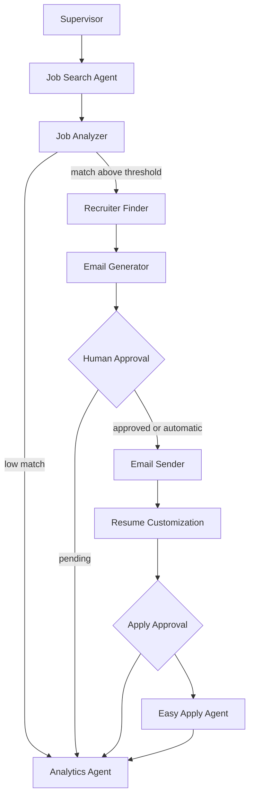

# Architecture

## Layers

- `agents`: LangGraph-callable units.
- `graphs`: Supervisor graph and routing functions.
- `services`: Email, resume, dedupe, job source, and Easy Apply domain logic.
- `repositories`: SQLAlchemy persistence boundary.
- `models`: Database tables.
- `schemas`: Pydantic state and API contracts.
- `playwright`: Browser session lifecycle and screenshots.
- `llm`: Provider abstraction.
- `api`: FastAPI endpoints.
- `dashboard`: Streamlit operator view.

## Production Notes

Use PostgreSQL by changing `DATABASE_URL`. Use Redis for distributed locks, portal rate limits, and
campaign queues. Long-running campaigns can be moved behind Celery or a LangGraph durable runtime.

